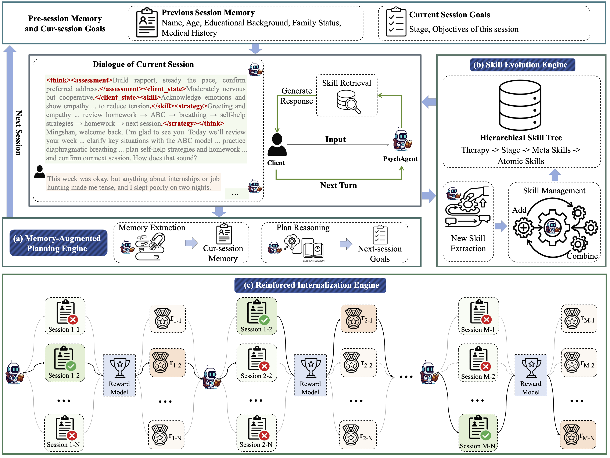
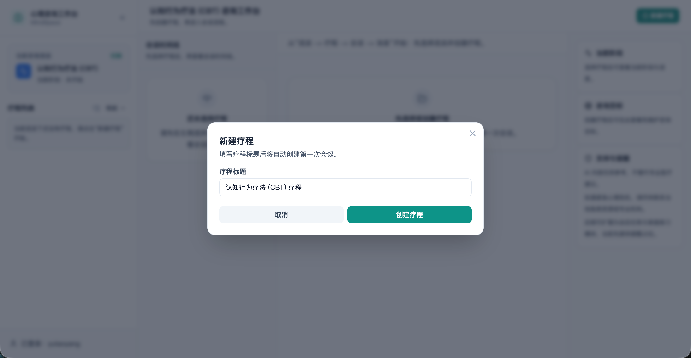
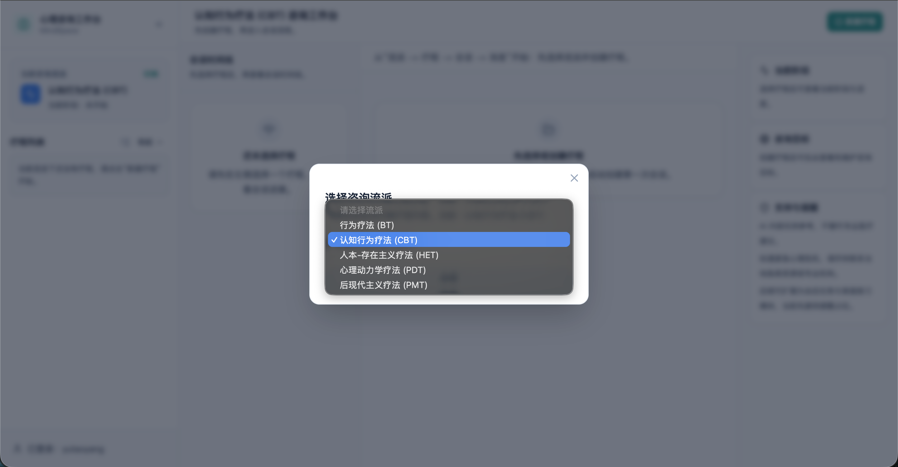
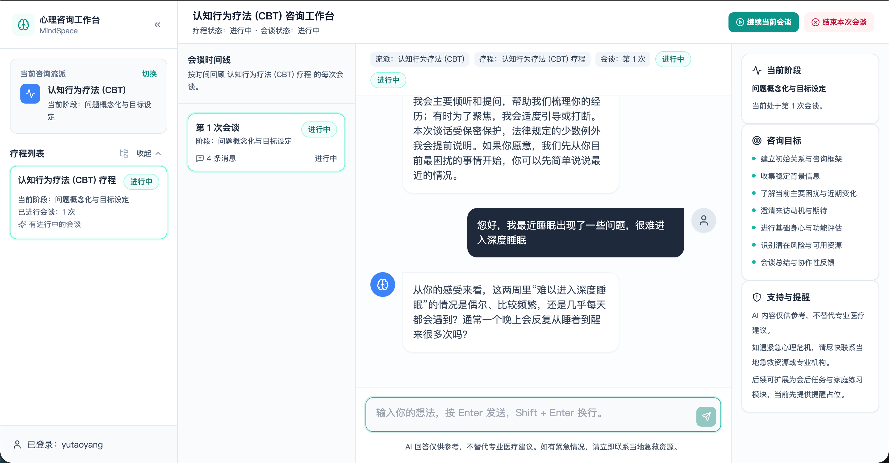

# PsychAgent

**PsychAgent: An Experience-Driven Lifelong Learning Agent for Self-Evolving Psychological Counselor**

<p align="center">
  <a href="https://github.com/ECNU-ICALK/PsychAgent"></a>
  <a href="https://arxiv.org/abs/2604.00931"></a>
  <a href="https://github.com/ECNU-ICALK/PsychAgent"></a>
  <a href="https://huggingface.co/ecnu-icalk/PsychAgent-Qwen3-32B"></a>
</p>

[English README](README.md)

PsychAgent 是一个面向多 session AI 心理咨询的研究型代码仓库。它关注长期咨询场景中的三件事：跨会话记忆与规划、咨询过程中的技能检索，以及基于 reward 的多轨迹选优。

论文材料：[PDF](paper/PsychAgent.pdf) | [arXiv 2604.00931](https://arxiv.org/abs/2604.00931)  
模型地址：[ecnu-icalk/PsychAgent-Qwen3-32B](https://huggingface.co/ecnu-icalk/PsychAgent-Qwen3-32B)

<p align="center">
  
</p>

## 项目简介

这个仓库是 PsychAgent 的公开研究代码版本，包含可运行的：

- 多 session 咨询生成流程
- 咨询师侧与来访者侧指标评测流程
- 基于 reward 的 best-of-n rollout 选优流程
- prompts、configs、论文材料和最小样例数据

当前版本已经覆盖公开的生成、评测和 RFT 工作流。论文中的全量训练资产，以及完整的 post-session skill evolution 闭环，不在这次公开快照中。

## 框架说明

从 README 角度看，PsychAgent 可以理解成三个可落地的模块：

- **记忆与规划**：保持跨 session 连续性，让后续会话建立在已有过程之上。
- **技能检索**：在对话过程中调用显式技能，辅助咨询生成。
- **Reward 选优**：对同一会话生成多条候选轨迹，再基于 reward 选出更好的结果。

在代码里，它们主要对应：

- [`src/sample/`](src/sample/)：多 session 生成
- [`src/eval/`](src/eval/)：评测与 reward 相关指标
- [`src/rft/`](src/rft/)：rollout 与 reward-based selection

## 仓库结构

建议优先关注这些目录：

- [`paper/`](paper/)：论文 PDF 和 README 使用的图表材料
- [`configs/`](configs/)：baseline、dataset、eval、RFT 配置
- [`assets/profiles/`](assets/profiles/)：`sample` 和 `rft` 使用的内置画像资产
- [`data/eval/`](data/eval/)：原生评测样例
- [`prompts/`](prompts/)：公共 prompt、来访者 prompt、PsychAgent prompt 和评测 prompt
- [`src/sample/`](src/sample/)：多 session 生成主流程
- [`src/eval/`](src/eval/)：评测编排与指标实现
- [`src/rft/`](src/rft/)：rollout 与 reward 选优
- [`src/web/`](src/web/)：面向体验和联调的 Web 工作台
- [`src/shared/`](src/shared/)：共享 YAML 与文件工具

如果你第一次进入仓库，推荐先看：

- [`src/README.md`](src/README.md)：代码入口说明
- [`configs/README.md`](configs/README.md)：配置文件说明

## 安装

PsychAgent 目前还没有提供锁定依赖的环境文件。下面这组命令适合作为当前公开版本的推荐安装方式：

```bash
python -m venv .venv
source .venv/bin/activate
pip install --upgrade pip
pip install openai httpx jinja2 pydantic PyYAML aiolimiter tenacity pytest
```

- 建议使用 **Python 3.10+**。
- 如果你需要 embedding 技能库加载或回填，再额外安装 `torch`。
- 仓库里的示例配置默认指向内部 OpenAI-compatible endpoint，实际运行前请替换成你自己的服务地址。
- 已发布模型可从 Hugging Face 获取：[ecnu-icalk/PsychAgent-Qwen3-32B](https://huggingface.co/ecnu-icalk/PsychAgent-Qwen3-32B)。

## 必需环境变量

默认示例主要依赖以下环境变量：

- `SGLANG_API_KEY`：`sample` 和 `rft` 使用的咨询师后端密钥
- `API_KEY`：`sample` 的来访者模拟器密钥，或 `rft` 的 client / reward 密钥
- `CHAT_API_KEY`：`eval` 的默认评测密钥，也可作为 reward 评测的回退配置
- `CHAT_API_BASE`：`eval` 使用的默认 base URL
- `CHAT_MODEL_NAME`：可选的 `eval` 模型覆盖项
- `PSYCHAGENT_EMBEDDING_API_KEY`：当前技能检索链路需要的 embedding 密钥

## 快速开始

### 1. 运行多 session 生成

```bash
export SGLANG_API_KEY=your_key_here
export API_KEY=your_client_simulator_key_here

python -m src.sample \
  --mode psychagent \
  --baseline configs/baselines/psychagent_sglang_local.yaml \
  --runtime configs/runtime/psychagent_sglang_local.yaml \
  --dataset configs/datasets/profiles_sample.yaml \
  --strict-config
```

默认输出目录为：

```text
sample_outputs/before_rft/<modality>/<case_id>/
```

每个 case 目录通常包含 `course.json` 和 `session_*.json`。

### 2. 运行评测

评测仓库内置的 eval 样例：

```bash
export CHAT_API_KEY=your_eval_key_here
export CHAT_API_BASE=https://your-openai-compatible-endpoint/v1

python -m src.eval \
  --config configs/runtime/eval_default.yaml \
  --input-format auto \
  --modalities bt,cbt,het,pdt,pmt
```

评测 `sample` 生成结果：

```bash
python -m src.eval \
  --config configs/runtime/eval_default.yaml \
  --input-format sample \
  --data-root sample_outputs/before_rft \
  --output-root data/eval_outputs_from_sample \
  --modalities cbt
```

### 3. 运行 reward-driven best-of-n rollouts

```bash
export SGLANG_API_KEY=your_key_here
export API_KEY=your_client_or_reward_key_here

python -m src.rft \
  --baseline configs/baselines/psychagent_sglang_local.yaml \
  --runtime configs/runtime/psychagent_sglang_local.yaml \
  --dataset configs/datasets/psycheval_bt_cbt_het_pdt_pmt.yaml \
  --rft-config configs/runtime/rft_default.yaml \
  --save_dir rft_outputs \
  --strict-config
```

如果你想直接基于仓库内置画像资产运行 `rft`，可以把 `--dataset` 改成 [`configs/datasets/profiles_rft.yaml`](configs/datasets/profiles_rft.yaml)。

### 4. 体验 Web 工作台

如果你希望直接在浏览器中体验多 session 咨询流程，可以使用 [`src/web/`](src/web/) 下的 Web 工作台。更完整的页面说明见 [`src/web/README.md`](src/web/README.md)。

推荐启动顺序如下：

1. 先部署咨询师模型服务
2. 再启动 Web 后端
3. 最后启动前端页面

咨询师模型可按下面的方式启动：

```bash
nohup python -m sglang.launch_server \
    --model-path /path/to/psychagent-checkpoint \
    --trust-remote-code \
    --port 30000 \
    --tp 8 \
    --host 0.0.0.0 \
    > /path/to/logs/sglang_server.log 2>&1 &
```

请将 [`configs/baselines/psychagent_sglang_local.yaml`](configs/baselines/psychagent_sglang_local.yaml) 中的 `base_url` 修改为你的模型服务地址。

然后可以在项目根目录准备一个简单的 `.env.local`：

```bash
SGLANG_API_KEY=your-sglang-key
PSYCHAGENT_EMBEDDING_API_KEY=your-embedding-key
BACKEND_PORT=8000
FRONTEND_PORT=5173
BACKEND_HOST=localhost
```

在项目根目录启动：

```bash
./run_backend.sh
./run_frontend.sh
```

默认访问地址：

```text
前端：http://localhost:5173
后端：http://localhost:8000
健康检查：http://localhost:8000/health
```

页面使用顺序通常是：

1. 登录或注册
2. 选择咨询流派
3. 创建疗程
4. 开始会谈
5. 结束当前会谈并继续下一次

下面是 Web 工作台的几个界面示意：

#### 创建疗程



#### 切换流派



#### 会谈界面



## 配置说明

三个主工作流使用的配置组合不同：

- `sample`：`baseline + runtime + dataset`
- `eval`：`runtime`
- `rft`：`baseline + runtime + dataset + rft-config`

如果你需要进一步了解：

- 模型端点和 API key 改在哪里
- 输出语言、并发、续跑参数改在哪里
- dataset、split、modality 怎么切换
- reward 端点和 rollout 数量怎么配置

请直接看 [`configs/README.md`](configs/README.md)。

## 已包含的资源

仓库当前已经包含：

- [`assets/skills/sect/`](assets/skills/sect/) 下的初始化技能库
- [`assets/profiles/`](assets/profiles/) 下的内置画像资产
- [`data/eval/`](data/eval/) 下的评测样例
- `bt`、`cbt`、`het`、`pdt`、`pmt` 五种 modality 的 prompt
- 共享指标与 therapy-specific 指标的评测方法与 prompt
- [`paper/`](paper/) 下的论文与图表材料
- Hugging Face 上已发布的模型权重

本次公开版本不包含：

- 论文使用的完整 `PsychEval` 训练与评测资产
- 完整的 post-session skill extraction / evolution pipeline
- 完整的 end-to-end internalization 后训练流程
- 仓库许可证文件

## 结果摘要

论文在多 therapy、多 session 的 `PsychEval` 基准上评测 PsychAgent。

- `PsychAgent`（Qwen3-32B）在 counselor-shared、counselor-specific、client-shared、client-specific 四类指标上报告 `7.32 / 7.91 / 5.92 / 8.24`
- 相较 `Qwen3-Max`，论文报告提升为 `+1.44 / +0.17 / +0.51 / +0.43`
- 相较 `TheraMind`，论文报告提升为 `+1.07 / +0.97 / +0.44 / +0.41`
- 在 522 条对齐对话上，PsychAgent 被两位人工标注者和 Gemini-3 LLM rater 一致排为第一；human-human QWK 为 `0.675`

相关论文材料见 [`paper/radar_v1.pdf`](paper/radar_v1.pdf)、[`paper/trend.pdf`](paper/trend.pdf) 和 [`paper/fig_11_qwk_heatmap_abc.png`](paper/fig_11_qwk_heatmap_abc.png)。

## 项目状态

PsychAgent 当前更适合作为研究代码仓库来使用，而不是一个已经完全产品化的发布版本。现有仓库已经覆盖公开的生成、评测和 best-of-n reward selection 工作流；如果要进一步面向更广泛用户发布，仍建议补充：

- 仓库许可证
- 锁定依赖的环境文件
- 对外可直接复用的服务模板配置
- 更完整的 paper-scale 复现实验说明
- 已发布 checkpoint 的推理和部署建议

## 引用

论文页面：[arXiv:2604.00931](https://arxiv.org/abs/2604.00931)

```bibtex
@misc{yang2026psychagent,
  title         = {PsychAgent: An Experience-Driven Lifelong Learning Agent for Self-Evolving Psychological Counselor},
  author        = {Yutao Yang and Junsong Li and Qianjun Pan and Jie Zhou and Kai Chen and Qin Chen and Jingyuan Zhao and Ningning Zhou and Xin Li and Liang He},
  year          = {2026},
  eprint        = {2604.00931},
  archiveprefix = {arXiv},
  primaryclass  = {cs.AI},
  url           = {https://arxiv.org/abs/2604.00931},
  doi           = {10.48550/arXiv.2604.00931}
}
```

## 安全说明

- 本仓库仅供**研究和实验用途**使用。
- 它**不能替代**持证心理健康专业人员、医学诊断、紧急干预或危机处理服务。
- 如需真实部署，还需要额外补充安全、隐私、知情同意、监控、升级处置和临床治理等工作。
- 如果有人可能面临即时伤害风险，请联系当地紧急服务或危机支持渠道，而不是依赖自动化系统。

## 致谢

- [`PsychEval`](configs/datasets/psycheval_bt_cbt_het_pdt_pmt.yaml) 提供了论文采用的基准设定与评测协议
- 本仓库中使用的 OpenAI-compatible API 工具链、Jinja2 模板，以及基于 Pydantic 的校验逻辑
