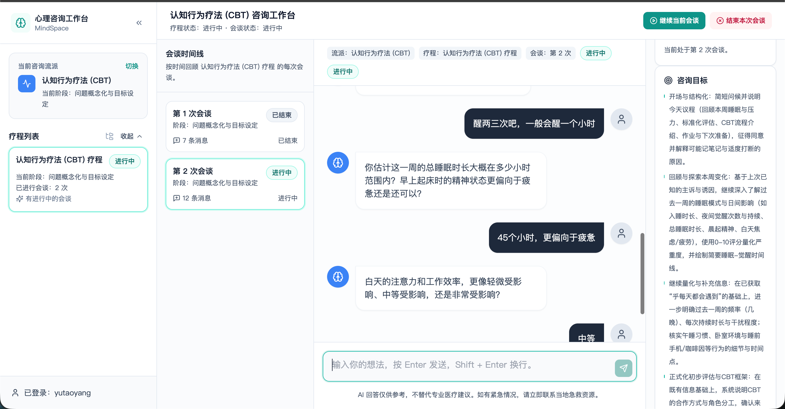

# PsychAgent Web

PsychAgent Web 是一个用于体验 PsychAgent 多轮咨询流程的网页工作台。  
PsychAgent Web is a browser-based workspace for experiencing the multi-session counseling flow of PsychAgent.

它提供了前端界面与本地联调后端，适合演示、试用和轻量开发。  
It includes a user-facing frontend and a local backend for demo, usage, and lightweight development.

## Features / 功能特性

- 注册与登录 / Sign up and sign in
- 按咨询流派创建疗程 / Create courses by counseling school
- 自动开始首次会谈 / Auto-start the first session
- 在会谈中持续对话 / Chat continuously during a session
- 结束当前会谈并开始下一次 / Close the current session and continue to the next
- 完成整个疗程 / Complete a full course

## Screenshots / 页面截图

### 创建疗程 / Create Course


### 切换流派 / Switch School


### 会谈界面 / Consultation View


### 后续会谈 / Follow-up Session



## Deploy Counselor Model / 部署咨询师模型

如果你需要先部署咨询师模型服务，再连接 Web 工作台，可以先启动 `sglang` 服务。  
If you need to deploy the counselor model service before using the web app, start the `sglang` server first.

示例命令如下：

```bash
nohup python -m sglang.launch_server \
    --model-path /path/to/psychagent-checkpoint \
    --trust-remote-code \
    --port 30000 \
    --tp 8 \
    --host 0.0.0.0 \
    > /path/to/logs/sglang_server.log 2>&1 &
```

请将 [`../../configs/baselines/psychagent_sglang_local.yaml`](../../configs/baselines/psychagent_sglang_local.yaml) 中的 `base_url` 修改为你的模型服务地址。  
Update the `base_url` in [`../../configs/baselines/psychagent_sglang_local.yaml`](../../configs/baselines/psychagent_sglang_local.yaml) to match your model service endpoint.

## One-Click Start / 一键启动

推荐从项目根目录启动。  
The recommended way is to start from the project root.

项目根目录：

```bash
cd PsychAgent_v0402
```

### 1. 准备 `.env.local`

你可以在项目根目录创建 `.env.local`：

```bash
SGLANG_API_KEY=your-sglang-key
PSYCHAGENT_EMBEDDING_API_KEY=your-embedding-key
BACKEND_PORT=8000
FRONTEND_PORT=5173
BACKEND_HOST=localhost
```

### 2. 启动后端

```bash
./run_backend.sh
```

### 3. 启动前端

新开一个终端窗口：

```bash
./run_frontend.sh
```

默认访问地址：

```text
Frontend: http://localhost:5173
Backend:  http://localhost:8000
Health:   http://localhost:8000/health
```

## Manual Setup / 手动启动

如果你更习惯在 `src/web` 目录内手动运行，也可以使用下面的方式。  
If you prefer running everything manually inside `src/web`, use the steps below.

### 1. 进入目录 / Enter the web directory

```bash
cd src/web
```

### 2. 安装前端依赖 / Install frontend dependencies

```bash
npm install
```

### 3. 准备 Python 环境 / Prepare Python environment

```bash
python3 -m venv .venv
source .venv/bin/activate
python3 -m pip install --upgrade pip
python3 -m pip install -r requirements.txt
```

### 4. 配置环境变量 / Configure environment variables

```bash
export SGLANG_API_KEY="your-sglang-key"
export PSYCHAGENT_EMBEDDING_API_KEY="your-embedding-key"
```

如需覆盖默认配置：

```bash
export PSYCHAGENT_WEB_BASELINE_CONFIG="configs/baselines/psychagent_sglang_local.yaml"
export PSYCHAGENT_WEB_RUNTIME_CONFIG="configs/runtime/psychagent_sglang_local.yaml"
```

### 5. 启动后端 / Start backend

```bash
uvicorn main:app --reload --host 0.0.0.0 --port 8000
```

### 6. 启动前端 / Start frontend

新开一个终端窗口：

```bash
npm run dev
```

## How To Use / 使用方式

1. 打开网页并注册或登录。  
   Open the web app and sign in.
2. 选择咨询流派。  
   Choose a counseling school.
3. 创建新的疗程。  
   Create a new course.
4. 在聊天窗口中开始会谈。  
   Start chatting in the session view.
5. 当前会谈结束后，关闭本次会谈并进入下一次。  
   Close the current session and move to the next one.
6. 当整个疗程完成后，执行疗程完成操作。  
   Mark the course as completed when the full process is done.

## Configuration / 配置说明

### Frontend / 前端

前端默认请求：

```text
http://localhost:8000
```

如果后端地址不同，可在启动前覆盖：

```bash
VITE_API_BASE=http://127.0.0.1:8001 npm run dev
```

### Backend / 后端

常用环境变量：

- `PSYCHAGENT_WEB_BASELINE_CONFIG`
- `PSYCHAGENT_WEB_RUNTIME_CONFIG`
- `DB_URL`
- `SGLANG_API_KEY`
- `PSYCHAGENT_EMBEDDING_API_KEY`

默认数据库文件为 `data.db`。  
The default local database file is `data.db`.

## Build / 构建

生产构建：

```bash
npm run build
```

本地预览构建结果：

```bash
npm run preview
```

构建产物输出到：

```text
dist/
```

## Requirements / 环境要求

- Node.js 18+
- npm
- Python 3.10+
- 可用的模型服务配置 / Available model service configuration
- 对应的 API key 或 embedding key / Required API or embedding keys

## Troubleshooting / 常见问题

### 页面能打开，但请求失败

通常是前后端地址没有对齐。优先检查：

- 后端是否运行在 `8000` 端口
- 前端是否使用了正确的 `VITE_API_BASE`

### 后端启动时报缺少 key

默认配置依赖：

- `SGLANG_API_KEY`
- `PSYCHAGENT_EMBEDDING_API_KEY`

如果不想使用默认链路，请改用自己的 baseline / runtime 配置。

### 页面样式异常

当前页面样式依赖 Tailwind CDN。若运行环境无法访问外网 CDN，页面可能能打开，但样式会不完整。

### `npm install` 后仍然有原生依赖问题

可以尝试：

```bash
npm install --include=optional
```

## Project Layout / 目录概览

- `src/`: 前端页面 / frontend app
- `backend/`: Web API
- `main.py`: 后端入口 / backend entry
- `requirements.txt`: 后端依赖 / backend dependencies
- `package.json`: 前端依赖与脚本 / frontend scripts and dependencies

## Related Docs / 相关文档

- [Project README](../../README.md)
- [Project README CN](../../README_CN.md)
- [Source Code Guide](../README.md)
